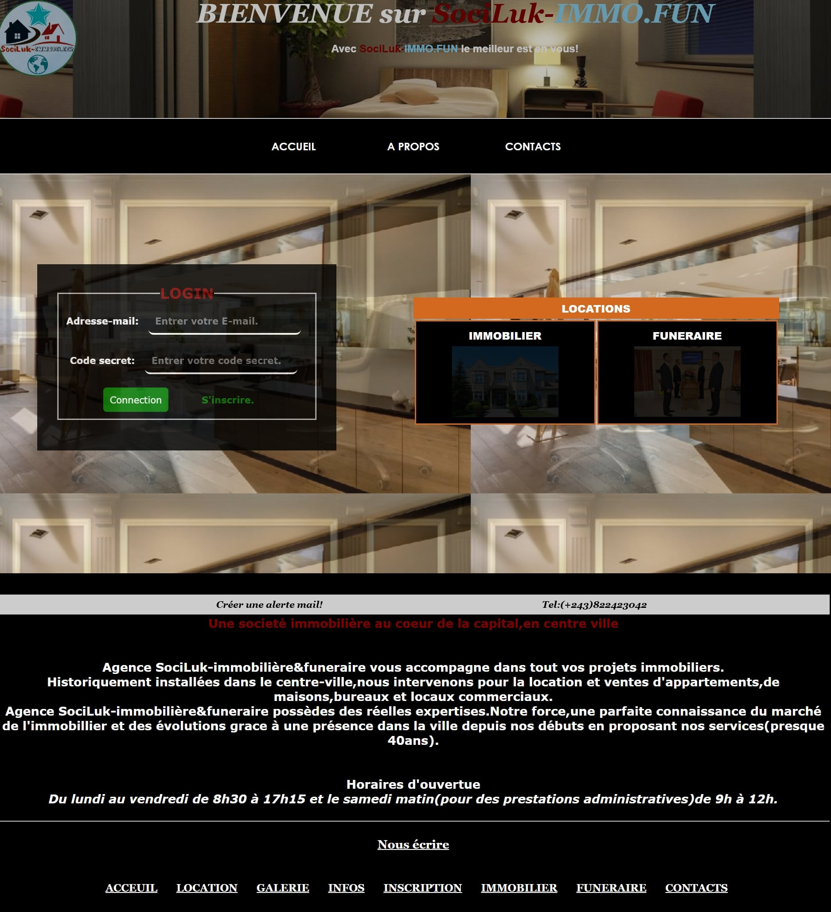
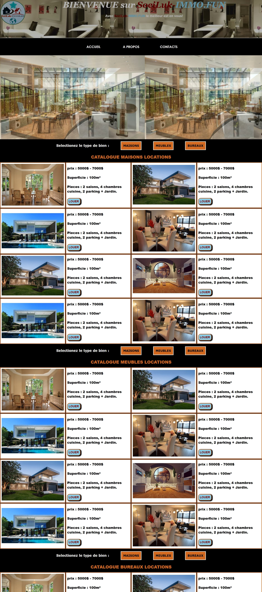

# Mon_premier_projet
Création d'un site web statique pour une agence des services immobiliers et pompes funèbres.

-----

## Date du projet

- Ce projet personnel a été réalisé en 2018 .

-----

## Fonctionnalités

- Navigation fluide entre différentes pages.
- Design pas très responsive( mais évolutif ).
- statique mais évolutif.

-------

## Technologies utilisées

- HTML;
- CSS;
- SublimeText;
- Vscode;
- Adobe Photoshop

--------

## Aperçu

- 
- 
